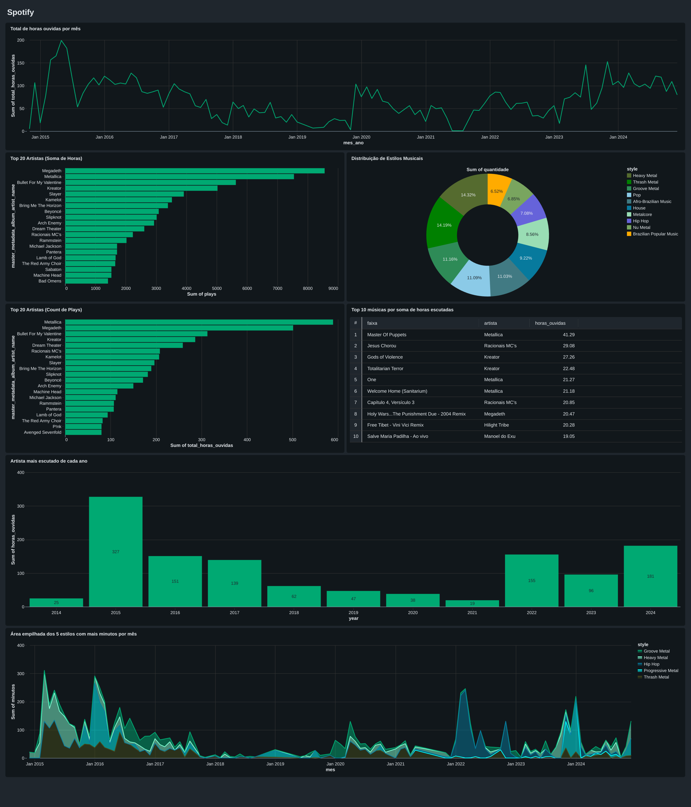

# Spotify + Databricks (Bronze → Silver → Gold + Lakeview)

Projeto de engenharia de dados no **Databricks** para coletar, tratar e analisar dados do Spotify, com visualização no **Lakeview**.

## 📦 Estrutura do repositório

- `Silver Spotify.ipynb` — limpeza/normalização (camada Silver)
- `Enriquecimento de Estilos.ipynb` — features/atributos musicais enriquecidos com LLM
- `Criação - Gold.ipynb` — modelagem analítica (camada Gold)
- `Spotify.lvdash.json` — export do dashboard Lakeview
- `Spotify 2025-08-29 19_50.pdf` — dashboard Lakeview em PDF
- `dash/spotify-dashboard-thumb.png` — miniatura (thumbnail) do PDF

## 📊 Dashboard (PDF)

## 🔎 Visão Geral das camadas

- **Bronze**: ingestão bruta (schema próximo do original)
- **Silver**: padronização de tipos, normalização e chaves
- **Gold**: métricas e visões analíticas 

## 🧠 Enriquecimento de Estilos (LLM · DeepSeek)

**Notebook:** [notebooks_querys/Enriquecimento de Estilos.ipynb](notebooks_querys/Enriquecimento%20de%20Estilos.ipynb)

Esse notebook adiciona uma etapa de **enriquecimento de estilos musicais** usando um **LLM (DeepSeek)**.  
Ele envia informações das faixas (título, artista, metadados) para o modelo, que retorna rótulos e descrições de estilos, depois gravados como novas colunas no dataset.

### Destaques
- Permite capturar nuances de **gênero** que não aparecem diretamente nos dados brutos. Ainda será preciso validar, mas os resultados até o momento são excelentes, principalmente se considerarmos que os subgêneros do Metal são confusos até para os próprios fãs de Heavy Metal.
- Facilita análises segmentadas e visualizações no **Lakeview**.
- **Custo extremamente baixo**: até o momento foram **~US$ 0,38** para mais de **1,6 milhão de tokens processados**.

---

## ▶️ Como reproduzir no Databricks

1. **Repos → Clone** este repositório.
2. Execute os notebooks na ordem sugerida:
   - `Silver Spotify.ipynb`
   - `Enriquecimento de Estilos.ipynb`
   - `Criação - Gold.ipynb`
3. Abra o dashboard no **Lakeview** e (opcionalmente) exporte:
   - **PDF**: atualizar `Spotify 2025-08-29 19_50.pdf`
   - **PNG** dos gráficos (se quiser incluir imagens adicionais no README)
4. (Opcional) Gere/atualize a miniatura do PDF e salve em `dash/spotify-dashboard-thumb.png`.
5. **Commit & Push** pelo Databricks Repos.

## 📊 Resultados (insights do dashboard)

O dashboard Lakeview mostra algumas tendências interessantes nos dados do Spotify:

- 🎵 **Top artistas por número de plays:**
  - Metallica (Thrash Metal)
  - Megadeth (Thrash Metal)
  - Bullet For My Valentine (Metalcore)
  - Kreator(Thrash Metal)
  - Slayer (Thrash Metal)

- 🎵 **Top artistas por horas:**
  - Metallica	(Thrash Metal)
  - Megadeth	(Thrash Metal)
  - Bullet For My Valentine	(Metalcore)
  - Kreator	(Thrash Metal)
  - Dream Theater	(Progressive Metal) (Também, só tem música de 1h 😬)

- 🏷️ **Distribuição de estilos musicais (gêneros):**
  - Heavy Metal (14.32%)
  - Thrash Metal (14.19%)
  - Groove Metal (11.16%)
  - Pop (11.09%)
  - Afro-Brazilian Music (11.03%)
  - House (9.22%)
  - Metalcore (8.56%)
  - Hip-Hop (7.08%)

- 🎧 **Top 10 músicas por horas escutadas:**
  1.  *Master Of Puppets* - Metallica - (41.29h)
  2.  *Jesus Chorou* - Racionais MC's - (29.08h)
  3.  *Gods of Violence* - Kreator - (27.26h)
  4.  *Totalitarian Terror* - Kreator - (22.48h)
  5.  *One* - Metallica - (21.27h)
---

## 🧪 Tecnologias

- Databricks (Repos, Notebooks, Lakeview)
- Python / PySpark
- LLMs (DeepSeek) para enriquecimento de atributos musicais
- Camadas **Bronze/Silver/Gold** para organização de dados

## 📝 Licença

MIT
