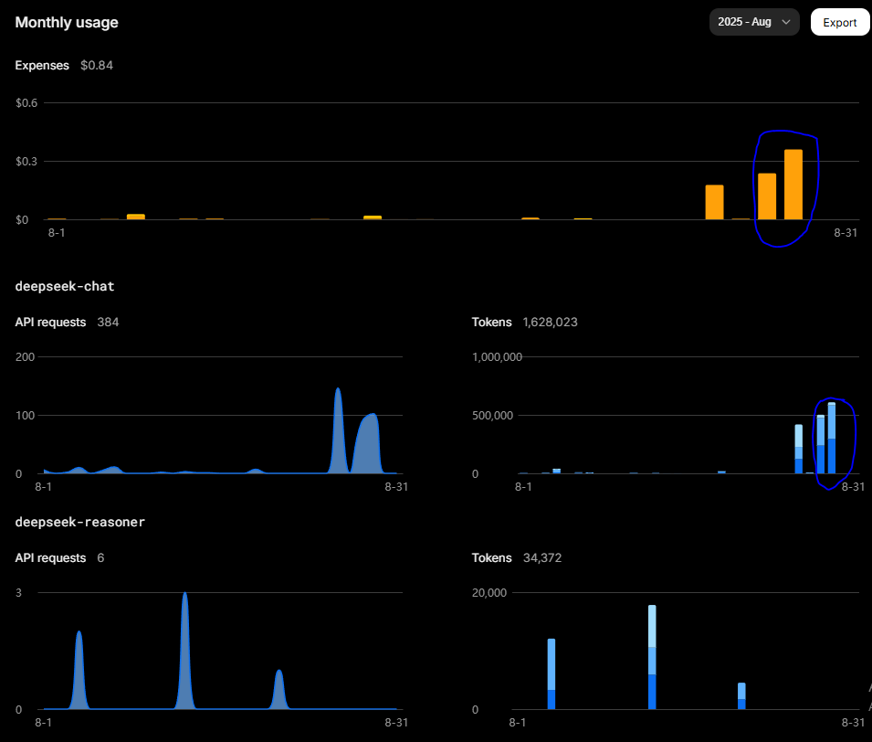

# Spotify + Databricks (Bronze → Silver → Gold + Lakeview)

Projeto de engenharia de dados no **Databricks** para coletar, tratar e analisar dados do Spotify, com visualização no **Lakeview**.

## 📦 Estrutura do repositório

- `Silver Spotify.ipynb` — limpeza/normalização (camada Silver)  
- `Enriquecimento de Estilos.ipynb` — features/atributos musicais enriquecidos com LLM  
- `Criação - Gold.ipynb` — modelagem analítica (camada Gold)  
- `Spotify.lvdash.json` — export do dashboard Lakeview  
- `dash/Spotify 2025-08-29 21_24.pdf` — dashboard Lakeview em PDF  
- `dash/*.png` — imagens das visões do dashboard exportadas individualmente  

## 📊 Dashboard (PDF)

[📄 Abrir o Dashboard em PDF](dash/Spotify%202025-08-29%2021_24.pdf)

> O PDF contém a versão completa do dashboard no Lakeview.

## 🖼️ Visões do Dashboard (PNGs)

-   
-   
-   
-   
- .png)  
- .png)  
-   

---

## 🔎 Visão Geral das camadas

- **Bronze**: ingestão bruta (schema próximo do original)  
- **Silver**: padronização de tipos, normalização e chaves  
- **Gold**: métricas e visões analíticas, já sendo possível alguns insights.

## 🧠 Enriquecimento de Estilos (LLM · DeepSeek)

**Notebook:** [notebooks_querys/Enriquecimento de Estilos.ipynb](notebooks_querys/Enriquecimento%20de%20Estilos.ipynb)

Esse notebook adiciona uma etapa de **enriquecimento de estilos musicais** usando um **LLM (DeepSeek)**.  
Ele envia informações das faixas (título, artista, álbum) para o modelo, que retorna o estilo, depois gravados como novas colunas no dataset.

### Destaques
- Permite capturar nuances de **gênero** que não aparecem diretamente nos dados brutos. Ainda será preciso validar, mas os resultados até o momento são excelentes, principalmente se considerarmos que os subgêneros do Metal são confusos até para os próprios fãs.  
- Facilita análises segmentadas e visualizações no **Lakeview**.  
- **Custo extremamente baixo**: até o momento foram **~US$ 0,38** para mais de **1,6 milhão de tokens processados**.  

---

## ▶️ Como reproduzir no Databricks

1. **Repos → Clone** este repositório.  
2. Execute os notebooks na ordem sugerida:  
   - `Silver Spotify.ipynb`  
   - `Enriquecimento de Estilos.ipynb`  
   - `Criação - Gold.ipynb`  
3. Abra o dashboard no **Lakeview**
4. **Commit & Push** pelo Databricks Repos.  

---

## 📊 Resultados (insights do dashboard)

O dashboard Lakeview mostra algumas tendências interessantes nos dados do Spotify:

- 🎵 **Top artistas por número de plays:**  
  - Metallica (Thrash Metal)  
  - Megadeth (Thrash Metal)  
  - Bullet For My Valentine (Metalcore)  
  - Kreator (Thrash Metal)  
  - Slayer (Thrash Metal)  

- 🎵 **Top artistas por horas:**  
  - Metallica (Thrash Metal)  
  - Megadeth (Thrash Metal)  
  - Bullet For My Valentine (Metalcore)  
  - Kreator (Thrash Metal)  
  - Dream Theater (Progressive Metal)  (Também né, cada música tem 1h 😬)

- 🏷️ **Distribuição de estilos musicais (gêneros):**  
  - Heavy Metal (14.32%)  
  - Thrash Metal (14.19%)  
  - Groove Metal (11.16%)  
  - Pop (11.09%)  
  - Afro-Brazilian Music (11.03%)  
  - House (9.22%)  
  - Metalcore (8.56%)  
  - Hip-Hop (7.08%)  

- 🎧 **Top músicas por horas escutadas:**  
  1. *Master Of Puppets* – Metallica – 41.29h  
  2. *Jesus Chorou* – Racionais MC’s – 29.08h  
  3. *Gods of Violence* – Kreator – 27.26h  
  4. *Totalitarian Terror* – Kreator – 22.48h  
  5. *One* – Metallica – 21.27h  

---

## 🧪 Tecnologias

- Databricks (Repos, Notebooks, Lakeview)  
- Python / PySpark  
- SQL
- LLMs (DeepSeek) para enriquecimento de atributos musicais  
- Camadas **Bronze/Silver/Gold** para organização de dados  

## 📝 Licença

Este projeto está licenciado sob a [MIT License](LICENSE).  
